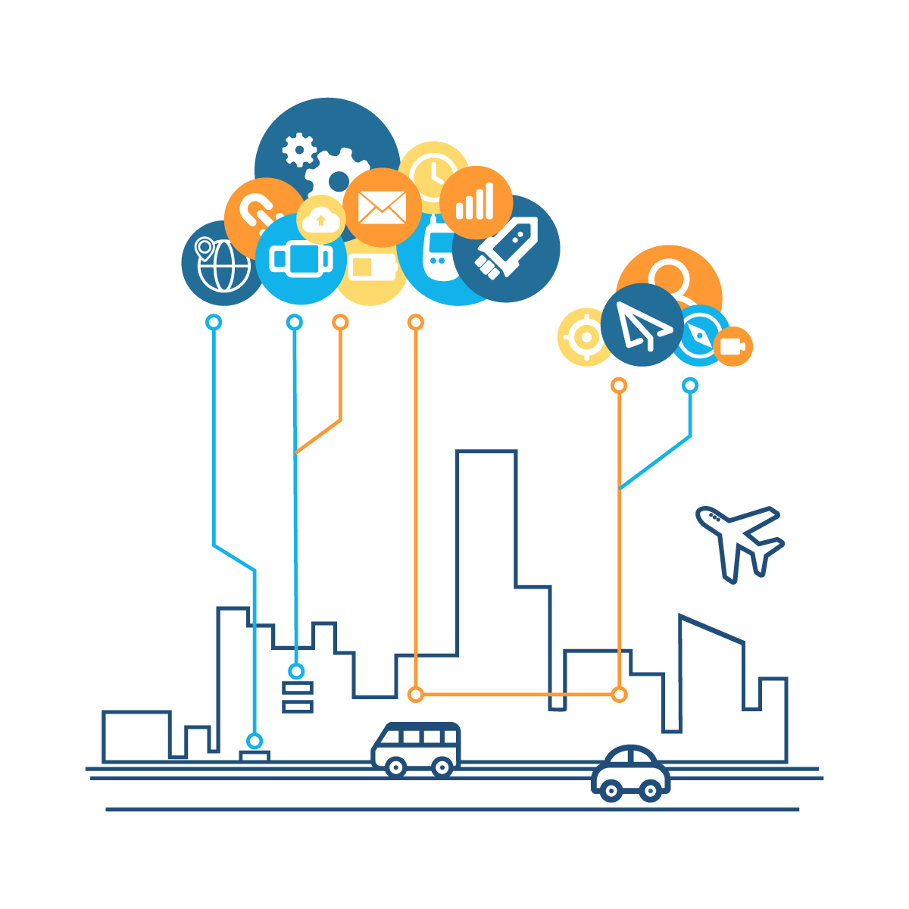

# Exercício de casa :memo:
*resumos*

## [O que é algoritmo?](https://tecnoblog.net/responde/o-que-e-algoritmo/)  

Pela definição de dicionário, algoritmo é:
> Um conjunto de regras e procedimentos lógicos perfeitamente definidos que levam a solução de um problema em um número finito de etapas

Ou seja, de uma simples receita de bolo à solução de um cubo mágico quase toda ação pode ser convertida em um algoritmo. Mas ele por si só não é um programa e sim as condições que devem ser atendidas para que o problema seja resolvido, tanto que o mesmo pode ser executado por diferentes fontes: computadores, autômatos e pessoas.

> *Autômato do filme que faz desenhos complexos a partir de um algoritmo.*

Um dos métodos mais utilizados para se desenvolver um algoritmo é utilizando um formato de **fluxograma**, um esquema visual com caracteristicas fixas que permitem que qualquer pessoa possa compreender o algoritmo de forma eficiente.

## :satellite: [Como a Internet funciona?](https://developer.mozilla.org/pt-BR/docs/Learn/Common_questions/How_does_the_Internet_work)

Começou como um projeto de pesquisa na década de 60, com o apoio das universidades e empresas privadas e tornou-se uma infraestrutura pública nos anos 80. Sua finalidade não mudou muito com o passar do tempo, ou seja, a Internet é uma gigantesca rede que liga computadores para garantir, em qualquer situação, que eles encontrem uma forma de se manter conectados. Mesmo hoje, na nova era, o termo "nuvem" nada mais é do que cabos de cobre de fibra óptica enterrados na terra, ocasionalmente via satélite ou rede de telefonia celular.

Podem ser conectados quantos computadores forem necessários, porém conforme aumenta a quantidade de computadores mais complicado se torna. Imaginamos que se você está tentando conectar, digamos, dez computadores, você irá precisar de 45 cabos, com 9 conexões por computador.
Para resolver este problema, cada computador na rede está conectado a um pequeno computador especial chamado de *roteador*. Este roteador tem um único trabalho: ter certeza de que a mensagem enviada por um determinado computador chegue ao computador destinatário corretamente, ou seja, garantir que a mensagem do computador A chegue no computador B e não seja entregue no computador C.

## :books: [Qual a diferença entre Framework e Biblioteca?](https://www.treinaweb.com.br/blog/qual-a-diferenca-entre-framework-e-biblioteca)

### O que é biblioteca?

 São conjuntos de códigos que padronizam determinadas soluções de problemas e sempre que alguem quiser solucionar determinado problema pode chamar a biblioteca, ou seja nós estamos fazendo uma calculadora, em vez de cada um escrever as funções de soma e subtração, chamamos uma biblioteca que já tem essas funções padronizadas, poupando tempo de desenvolvimento.

### O que é framework?
 
 É uma estrutura que permite o desenvolvimento, ele pode possuir uma coleção de bibliotecas com padrões pra facilitar seu desenvolvimento. Desta forma, o desenvolvedor acessa o framework que contém padrões de implementação (bibliotecas, funções, formas de chamada, jeitos de escrita e etc...) de modo que padronize todo o códigos escritos nesse framework e não só as funções

### A diferença
 
 A biblioteca permite um desenvolvimento mais "sem compromisso" permitindo você chamar quando quer e precisar de determinada funcionalidade sem se preocupar tanto com a estrutura utilizada, já o framework deve se seguir um padrão para esse desenvolvimento acontecer, ele já vem com uma estrutura pronta, o que pode significar menos liberdade nas escolhas de funcionalidade, porem mais segurança e agilidade.